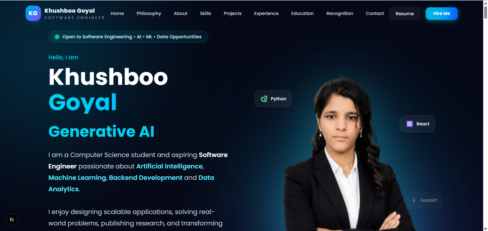

# 🌟 Khushboo Goyal | Software Engineering Portfolio

<div align="center">

### Modern • Responsive • Interactive • Developer Portfolio

A premium portfolio website showcasing my journey as a **Software Engineering Student**, **AI & Machine Learning Enthusiast**, and **Aspiring Full Stack Developer**.

Designed to provide recruiters, hiring managers, and collaborators with a comprehensive overview of my technical expertise, projects, achievements, certifications, education, and professional experience.

---

### 🌐 Live Portfolio

[**Live**](https://khushboo-portfolio-pink.vercel.app/)

---

### 📄 Resume

Available directly through the portfolio.

---

### 🤝 Connect

[LinkedIn](https://linkedin.com/in/khushboo-goyal-32bab0291) •
[GitHub](https://github.com/Khushboo1976) •
[LeetCode](https://leetcode.com/u/khushboo_1976/) •
Email: khushboo12244@gmail.com

</div>

---

# 📸 Portfolio Preview

> Add a full-width screenshot after deployment.

```
public/
└── preview.png
```

```md

```

---

# ✨ Features

- Premium modern UI/UX
- Fully responsive design
- Glassmorphism interface
- Interactive animations using Framer Motion
- Dynamic Hero section
- Philosophy section
- About section
- Skills & Technology Stack
- Featured Projects Showcase
- Professional Experience Timeline
- Education Timeline
- Recognition & Certifications
- Resume Download
- LinkedIn Integration
- Optimized for SEO
- Fast Loading
- Production Ready

---

# 🚀 Tech Stack

## Frontend

- Next.js 16
- React 19
- TypeScript
- Tailwind CSS v4
- Framer Motion

## UI

- Lucide React
- CSS Grid
- Flexbox
- Responsive Design

## Development

- VS Code
- Git
- GitHub

## Deployment

- Vercel

---

# 📂 Folder Structure

```text
portfolio/
│
├── app/
├── components/
│   ├── about/
│   ├── education/
│   ├── experience/
│   ├── footer/
│   ├── hero/
│   ├── layout/
│   ├── philosophy/
│   ├── projects/
│   ├── recognition/
│   └── tech-stack/
│
├── config/
├── public/
├── styles/
├── types/
├── utils/
│
├── package.json
├── tsconfig.json
├── README.md
└── LICENSE
```

---

# 📑 Portfolio Sections

- Hero
- Philosophy
- About Me
- Skills
- Projects
- Experience
- Education
- Recognition
- Contact Footer

---

# 📈 Performance

- Responsive across all devices
- SEO Friendly
- Optimized Images
- Smooth Animations
- Accessible Components
- Reusable Component Architecture
- Type Safe
- Modular Folder Structure

---

# 🖥️ Local Development

Clone the repository

```bash
git clone https://github.com/Khushboo1976/khushboo-portfolio.git
```

Move inside the project

```bash
cd khushboo-portfolio
```

Install dependencies

```bash
npm install
```

Run development server

```bash
npm run dev
```

Open

```
http://localhost:3000
```

Build production

```bash
npm run build
```

---

# 🎯 Purpose

This portfolio has been developed to showcase:

- Software Engineering Projects
- Full Stack Development Skills
- Artificial Intelligence Projects
- Machine Learning Experience
- Backend Development
- Data Analytics
- Research Publications
- Technical Certifications
- Professional Experience

---

# 🌱 Future Improvements

- Blog Section
- Case Studies
- Dark / Light Theme
- Project Filtering
- Interactive Dashboard
- Visitor Analytics
- Internationalization (i18n)

---

# 📬 Contact

**Khushboo Goyal**

📧 khushboo12244@gmail.com

💼 LinkedIn

https://linkedin.com/in/khushboo-goyal-32bab0291

💻 GitHub

https://github.com/Khushboo1976

🧩 LeetCode

https://leetcode.com/u/khushboo_1976/

---

# ⭐ Show Your Support

If you like this project, consider giving it a ⭐ on GitHub.

It motivates me to continue building open-source projects and sharing my work with the developer community.

---

# 📜 License

Licensed under the MIT License.

See the **LICENSE** file for more information.

---

<div align="center">

Made with ❤️ by **Khushboo Goyal**

© 2026 All Rights Reserved.

</div>
